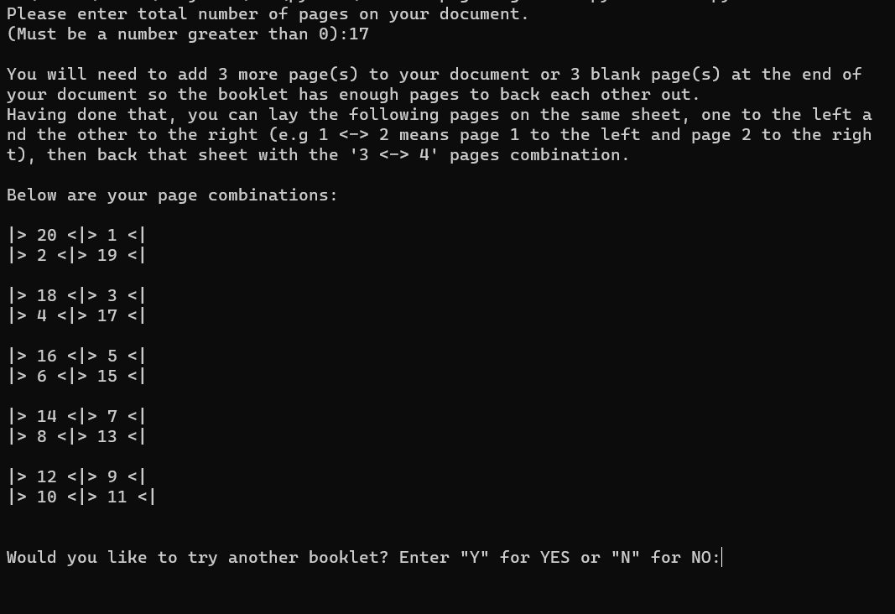

# Booklet Page Organizer
A commandline Python script to help graphic designers with arranging pages of a 
booklet so they can be printed with backing and adjacent pages in the right 
booklet order.

# Why Booklet Page Organizer
Having a background experience in printing and publishing, I noticed coworkers cut 
multiple pieces of paper to make a prototype booklet in order to be able to get the 
page arrangement for a booklet correct. This happened ever so often that I thought 
what we had a software tool to do this quickly and accurately, with the ability to
seemlessly alter the inputs without worry about wasting more time, paper and ink.

## Requirements
Python 3.7+

## Installation
No installtion necessary

## Usage
Make sure you have installed Python 3.7+.
Open the `main.py` file with your favourite commandline (bash, cmd, powershell, vscode, 
gitbash, etc) and follow the prompts to generate the page output.

## Future Plans
I plan to add an intuitive user interface (UI) as well as make the app available 
publicly as an open source web app for the none techy fellows.

## License
This project is licences under the MIT 2.0 Licence.
